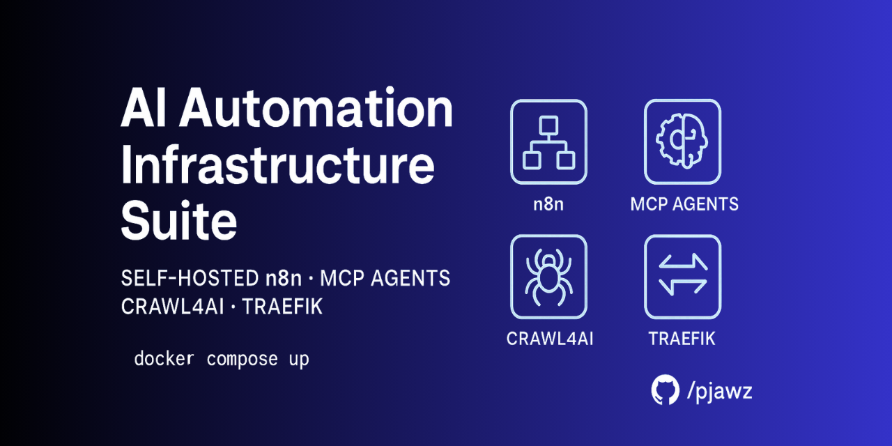

# Unified N8N AI Automation Infrastructure Suite

> **Self‑hosted AI & workflow automation platform — n8n orchestration, multi‑agent MCPs, Crawl4AI browser cluster, and Traefik reverse proxy in a single Docker Compose stack.**


## Features

-   **End‑to‑end automation** &mdash; orchestrate data flows, AI reasoning, browser actions, and scheduled tasks without juggling multiple servers.
-   **AI‑ready out of the box** &mdash; integrate OpenAI or local LLMs with n8n workflows; MCP agents handle scraping, parsing, and complex reasoning.
-   **Self‑hosted & Privacy‑first** &mdash; keep data and API keys on infrastructure you control.
-   **One‑command deployment** &mdash; `docker compose up -d` brings the entire stack online with SSL via Traefik and Let’s Encrypt.
-   **Batteries included** &mdash; sensible defaults, health checks, volume persistence, automated container updates (Watchtower), and pre‑configured Traefik labels.

## Included Services

| Layer              | Component                                                      | Image                            | Purpose                                                         |
| ------------------ | -------------------------------------------------------------- | -------------------------------- | --------------------------------------------------------------- |
| Orchestration      | **n8n** + Postgres                                             | `n8nio/n8n`                      | Low‑code workflow engine and database                           |
| Agent Layer        | **MCP servers** (Sequential‑Thinking, Supabase, Apify, GitHub) | community images                 | Specialized micro‑agents for scraping, API calls, and reasoning |
| Browser Automation | **Crawl4AI** (Chromium cluster)                                | `crawl4ai/crawl4ai`              | Dynamic web scraping & headless interaction                     |
| Networking         | **Traefik**                                                    | `traefik`                        | Reverse proxy with auto HTTPS & middleware                      |
| Messaging/Ops      | **Redis**, **Watchtower**                                      | `redis`, `containrrr/watchtower` | Queues/caching and zero‑downtime auto‑updates                   |

> **Tip :** Each service definition lives in its own subfolder with environment examples and scaling notes.

## Quick Start

```bash
# 1. Clone the repo
$ git clone https://github.com/pjawz/ai‑automation‑infrastructure‑suite.git
$ cd ai‑automation‑infrastructure‑suite

$ docker compose up -d

# 4. Access the UIs
- n8n : https://n8n.<your-domain>
- Traefik Dashboard : https://traefik.<your-domain>
- MCP APIs : https://mcp.<your-domain>/docs
- Crawl4AI : https://crawl.<your-domain>
```

## Current Architecture Overview

```
                           ┌──────────────┐
                           │   Clients    │
                           └──────┬───────┘
                                  │ HTTPS (Traefik)
┌─────────────────────────────────┴──────────────────────────────────┐
│                           Traefik Proxy                           │
└────────────┬───────────────┬───────────────┬───────────────┬───────┘
             │               │               │               │
       n8n.<domain>     mcp.<domain>   crawl.<domain>   traefik.<dom>
             │               │               │
       ┌─────▼─────┐   ┌─────▼─────┐   ┌─────▼─────┐
       │   n8n     │   │   MCP     │   │ Crawl4AI  │
       │ +Postgres │   │ cluster   │   │ Chromium  │
       └───────────┘   └───────────┘   └───────────┘
             │               │               │
             └───────►  Redis  ◄──────────────┘
```

_Full‑size diagram available in_ [`/docs/architecture.png`](docs/architecture.png)

## Scaling & Production Notes

1. **n8n workers** &mdash; add `n8n-worker` replicas with queue mode enabled.
2. **Postgres** &mdash; externalize to managed RDS or a separate container with persistent storage.
3. **Traefik** &mdash; enable sticky sessions when scaling n8n horizontally.
4. **Crawl4AI** &mdash; GPU acceleration optional; replicate containers behind internal load balancer.
5. **Logging/Monitoring** &mdash; integrate Loki/Grafana or ELK via the `/ops` overlay compose file.

## Customization Guide

-   **Adding a new agent** : copy `/services/mcp-supabase` as template, adjust image and labels, then append to `docker-compose.yml`.
-   **New sub‑domain** : add router rule in `/services/traefik/traefik.yml` and matching labels.
-   **Secrets management** : switch `.env` to `.envrc` + direnv, or use Docker Secrets.
-   **CI/CD** : reference `/.github/workflows/ci.yml` for automated build, lint, and push.

## Roadmap

-   [ ] More MCP Servers
-   [ ] Automated MCP server additions
-   [ ] Auto‑scaling rules for MCU/MCP cluster
-   [ ] One‑click n8n workflow templates

## Contributing

Pull requests welcome! Please open an issue first to discuss your proposed change. Follow the [Contributor Guidelines](docs/CONTRIBUTING.md) and our [Code of Conduct](docs/CODE_OF_CONDUCT.md).

## License

MIT © 2025. See [`LICENSE`](LICENSE) for details.
